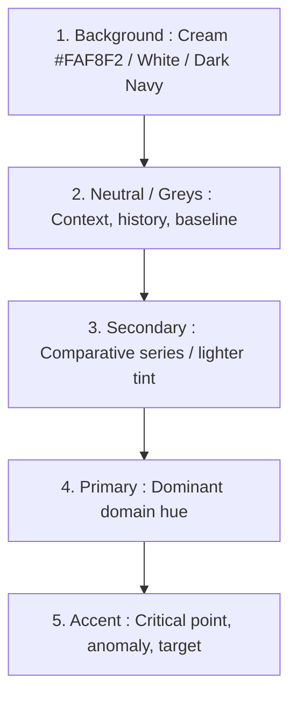

# Styling Presets, Modular Palettes & Domain Conventions

This reference defines typographic, chromatic, and aesthetic standards across the 3 visual systems.

---

## 🎭 The 3 Visual Systems

```
scientific   → Color = Pure Data Encoding (precision, perceptual uniformity, zero bias)
basic_custom → Color = Data Encoding + Visual Storytelling (attention hierarchy, spotlight, context)
dark         → Color = Data Encoding + UI Hierarchy (calibrated luminance, contrast without visual halo)
```

> **Attention Maxim**: *« A bright color means **“Look here!”**, not merely “Category B”. »*

---

### 1. Preset: `basic_custom` (Default — Contemporary Editorial / Data Journalism)
* **Goal**: Refined, executive-ready analytical visualization that is easy on the eyes.
* **Background**: `#FAF8F2` (Soft cream) or `#F7F4ED`
* **Text / Ink**: `#222222` (Near black)
* **Typography**:
  * Titles & Subtitles: `Georgia` (fallback: `DejaVu Serif`, `Times New Roman`)
  * Axes, Ticks, Labels, Annotations: `Helvetica` (fallback: `Arial`, `DejaVu Sans`)
* **Grid**: Subtle horizontal lines (`#E2E8F0`, linestyle=`--`, alpha=0.7)
* **Spines**: Remove top and right spines (`spines.top=False`, `spines.right=False`)

### 2. Preset: `scientific` (Academic Publishing & Reproducibility)
* **Goal**: Maximum precision and compliance with Nature, Science, IEEE, Cell guidelines.
* **Background**: `#FFFFFF` (Pure white)
* **Text / Ink**: `#000000` (Solid black)
* **Typography**: 100% Sans-serif (`Helvetica` / `Arial` / `DejaVu Sans`) across all elements (no serif).
* **Export Standards**: **Vector PDF/SVG export whenever possible**; **300 DPI minimum for raster exports (PNG/TIFF)**.

### 3. Preset: `dark` (Tech / Observability / Dashboards)
* **Goal**: Modern dark mode for operations dashboards, command centers, and presentations.
* **Background**: `#0F172A` (Dark Navy) or `#18181B` (Anthracite)
* **Text / Ink**: `#F1F5F9` (Off-white)
* **Typography**: Sans-serif for data/axes; optional serif for major headlines.
* **Contrast & Anti-Halo**:
  * Verify text/background and color/background contrast.
  * Avoid oversaturated colors that cause visual halo (*chromostereopsis*) or eye strain on dark screens.
* **Grid**: Very subtle gridlines (`#1E293B` at low opacity).

---

## 🎨 Modular Color Architecture



### Dominant Family Palettes (Plug into Primary/Secondary):

```python
PALETTES = {
    "blues": {
        "primary": "#1D4ED8",
        "secondary": "#93C5FD",
        "accent": "#DC2626", # Crimson callout
        "neutral": "#94A3B8"
    },
    "oranges": {
        "primary": "#EA580C",
        "secondary": "#FDBA74",
        "accent": "#1E3A8A", # Deep navy callout
        "neutral": "#94A3B8"
    },
    "greens": {
        "primary": "#059669",
        "secondary": "#A7F3D0",
        "accent": "#B91C1C", # Red callout
        "neutral": "#94A3B8"
    },
    "reds": {
        "primary": "#DC2626",
        "secondary": "#FCA5A5",
        "accent": "#1E3A8A", # Navy callout
        "neutral": "#94A3B8"
    },
    "greys": { # Minimalist / Spotlight theme
        "primary": "#334155",
        "secondary": "#CBD5E1",
        "accent": "#EA580C", # Vibrant orange focal pop
        "neutral": "#94A3B8"
    }
}
```

---

## 🔬 Mathematical Palette Families

### 1. Qualitative / Categorical (Nominal Categories)
* **Use when**: Categories have no inherent numerical order.
* **Rules**: Max 5-7 distinct colors simultaneously.
* **Palettes**:
  * `Okabe-Ito` (Colorblind-Safe Standard): `["#000000", "#E69F00", "#56B4E9", "#009E73", "#F0E442", "#0072B2", "#D55E00", "#CC79A7"]`
  * `Set2`, `tab10`.

### 2. Sequential (Continuous Low $\rightarrow$ High)
* **Use when**: Values represent continuous magnitude, intensity, or volume.
* **Rules**: Must be **perceptually uniform** (equal steps in data correspond to equal steps in perceived brightness).
* **Palettes**: `viridis`, `cividis`, `magma`, `plasma` (or monochromatic `Blues`, `Greens`, `YlOrRd`).
* *Accessibility Note*: `cividis` is specifically designed to remain perceptually uniform across complete red-green and blue-yellow color vision deficiencies.

> [!IMPORTANT]
> **Key Scientific Distinction**: *Colorblind-safe does not automatically mean perceptually uniform.*  
> Okabe-Ito is colorblind-safe for *categorical* data, but is NOT a continuous colormap. Use Viridis/Cividis for continuous quantitative scales.

### 3. Diverging (Centered Around a Neutral Pivot)
* **Use when**: Data has a meaningful center point (Zero, Mean, Target, Baseline).
* **Rules**: **Mandatory central neutral value**. Never use on strictly positive data without a pivot. Always verify contrast and accessibility against the background.
* **Palettes**: `coolwarm`, `RdBu`, `PuOr`, `Spectral` (with explicit center).

---

## 📐 Robust Multi-OS Font Detection

```python
import matplotlib.font_manager as fm

def get_available_font(preferred_list, fallback="sans-serif"):
    available = {f.name for f in fm.fontManager.ttflist}
    for font in preferred_list:
        if font in available:
            return font
    return fallback

FONT_TITLE = get_available_font(["Georgia", "DejaVu Serif", "Times New Roman"], fallback="serif")
FONT_BODY = get_available_font(["Helvetica", "Arial", "DejaVu Sans"], fallback="sans-serif")
```
