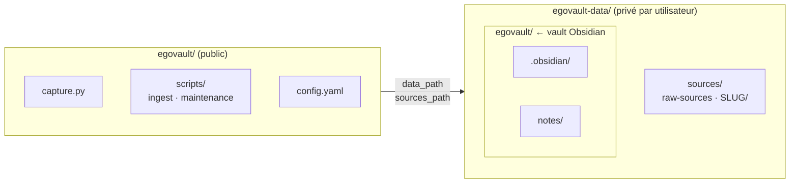
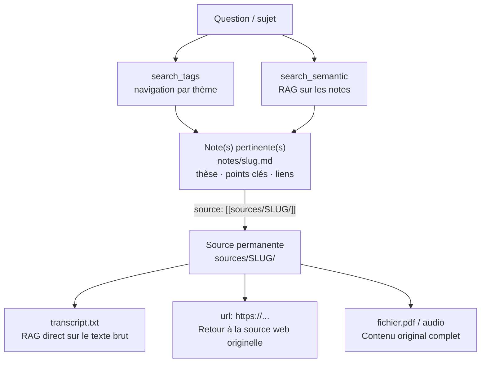
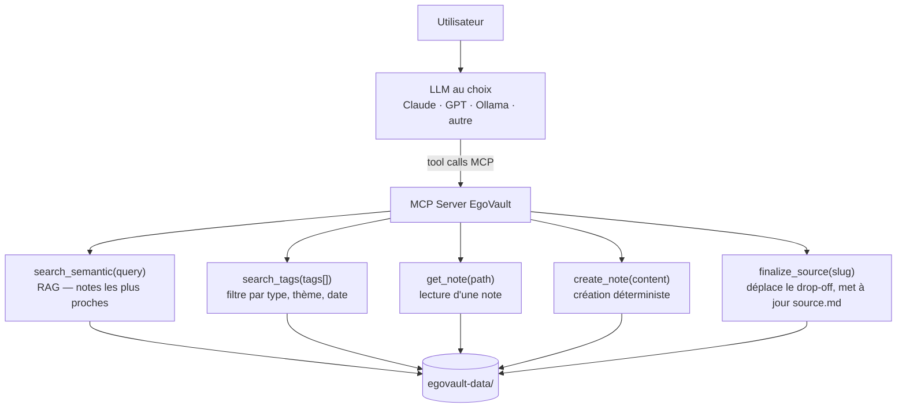
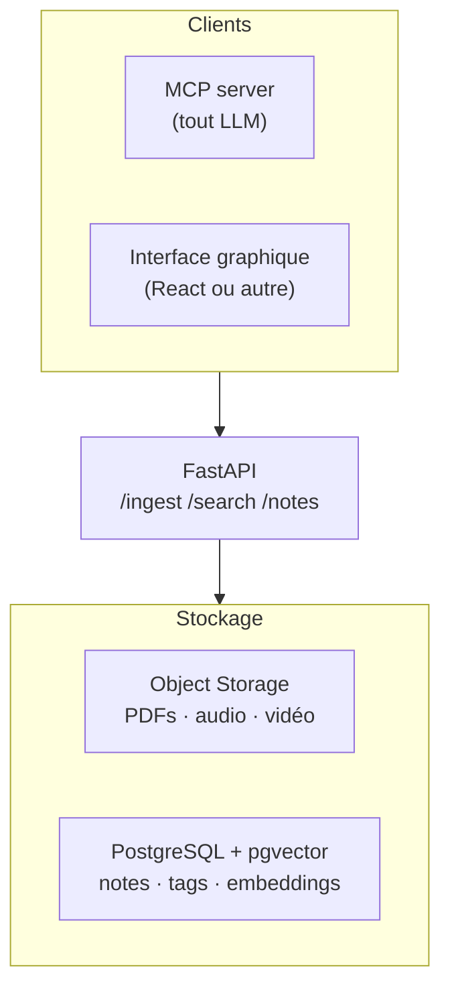

# EgoVault

> Une infrastructure de mémoire personnelle — pour toi et pour tes LLMs.

Tu consommes des idées en permanence — podcasts, vidéos, lectures, réflexions. Deux semaines plus tard, il n'en reste rien. Tes LLMs, eux, repartent de zéro à chaque conversation : ils ne savent pas ce que tu sais, ce que tu as pensé, ce que tu as lu.

**EgoVault construit le pont entre les deux.**

Un vault de notes structurées que tu alimentes au fil du temps. Plus qu'un outil de prise de notes, une véritable infrastructure cognitive à double usage.

**Pour toi** : un second cerveau où tes idées s'accumulent, se connectent et restent retrouvables. Les tags structurent ta navigation — tu explores par thème, tu vois les clusters émerger dans le graph Obsidian, tu retrouves une réflexion d'il y a six mois en deux clics. C'est le RAG humain : intuitif, visuel, thématique.

**Pour ton LLM** : une mine de contexte structuré, interrogeable à la demande. Recherche sémantique sur les notes pour cibler les plus pertinentes, filtrage par tags pour affiner, plongée dans la source originale si besoin. Le LLM ne repart plus de zéro — il travaille *depuis ce que tu sais*.

C'est ça la vraie force du système : **les mêmes tags, les mêmes liens, la même structure servent à la fois ta navigation humaine et le raisonnement machine.** Le vault est aussi lisible par toi dans Obsidian que par un LLM via MCP.

**Une utilisation ultra fluide.** Tu colles un lien YouTube, un fichier audio, une vidéo, une note de lecture ou simplement une réflexion ou note personnelle. La transcription en texte se fait automatiquement quelque soit la source. Tu branches ton LLM habituel — Claude, GPT, ou un modèle local — et il te propose directement une synthèse structurée, taguée, liée à tes autres notes. Tu valides, tu ajustes, tu sauvegardes. En quelques minutes, une vidéo d'une heure devient une note exploitable, versionnée, et connectée au reste de ta connaissance. Le LLM structure, toi tu penses, tu valides ses propositions ou tu suggères des modifications.

---

## Ce que ça change concrètement

| Problème | Ce que fait EgoVault |
|---|---|
| Les contenus consommés disparaissent | Capture en une commande → note distillée, indexée, retrouvable |
| Chaque session LLM repart de zéro | Les notes deviennent du contexte réutilisable, chargeable directement |
| Trop de notes pour tout charger dans un LLM | RAG sémantique → seules les notes pertinentes remontent au LLM |
| Les idées restent silotées | Tags + liens → clusters thématiques visibles dans Obsidian *et* filtrables par le LLM |
| Le LLM reformule dans le vide | Tu travailles *avec lui* : il structure, tu valides — la note finale est la tienne |
| On perd la source originale | Chaque note est liée à sa source préservée — transcript, PDF, URL accessible à tout moment |
| Lock-in sur un LLM ou un service | Architecture LLM-agnostique : tu branches le LLM que tu as déjà |

---

## Comment ça marche

### Pipeline en deux étapes

**Étape 1 — Ingestion déterministe** : `capture.py` télécharge, transcrit et dépose la source brute dans `raw-sources/`. Aucun LLM impliqué. 100% local, 100% testable.

**Étape 2 — Traitement intellectuel** : tu ouvres un Workflow LLM (A/B/C selon le type de source). Le LLM lit le drop-off, dialogue avec toi, propose une note structurée. Tu valides. La note rejoint le vault.

La séparation est intentionnelle : la transcription (longue, coûteuse en CPU) est sauvegardée avant le traitement. Si le dialogue est interrompu, rien n'est perdu.

### Architecture — Deux repos



Le code est une infrastructure générique — n'importe qui peut cloner `egovault` et le pointer vers son propre vault. Les données restent privées, jamais dans le repo public.

`sources/` est physiquement **hors du vault Obsidian** : les graphes ne montrent que des connexions entre idées, pas des fichiers de métadonnées.

### Notes et sources — deux niveaux de profondeur

Une note est une distillation : thèse, points clés, angle personnel, liens vers d'autres notes. Mais la source originale est toujours préservée et liée — transcript complet, PDF, ou URL. Ce double niveau permet un flow de navigation très précis :



**Pour l'humain** : tu navigues par tags dans Obsidian, tu lis la note, tu cliques sur le lien source si tu veux creuser.

**Pour le LLM** : il cherche sémantiquement dans les notes, lit les plus pertinentes, et si une source mérite d'être explorée plus en profondeur — il peut RAG directement sur le transcript brut, récupérer l'URL originale, ou citer la source précise.

La note est la porte d'entrée. La source est le fond du puits.

---

## Fonctionnalités

### Ingestion

| Source | Commande | Méthode |
|---|---|---|
| Vidéo YouTube | `capture.py "https://youtube.com/..."` | Sous-titres auto ou Whisper fallback |
| Fichier audio | `capture.py fichier.mp3 --title "Titre"` | faster-whisper local |
| Fichier vidéo | `capture.py fichier.mp4 --title "Titre"` | Extraction audio → Whisper |
| PDF *(à venir)* | `capture.py fichier.pdf` | pdfminer / pymupdf |
| Article web *(à venir)* | `capture.py "https://..."` | requests + beautifulsoup |

Option `--fast` pour les longues sources : modèle `small`, ~6-8× plus rapide.

### Queue d'ingestion

Tu peux empiler des sources à traiter plus tard, et les ingérer en batch :

```bash
capture.py queue add "https://youtube.com/..."
capture.py queue add fichier.mp3 --title "Conférence"
capture.py queue run       # traite tout
capture.py queue status    # état de la queue
```

### Vault et notes

Chaque note est un fichier Markdown avec frontmatter YAML — lisible partout, versionnable, Obsidian-compatible.

```yaml
---
date_creation: 2026-03-22
note_type: synthese          # idee | synthese | reflexion | concept
source_type: youtube         # youtube | audio | video | pdf | web | livre | personnel
depth: note                  # atomique | note | approfondi
tags: [decentralisation, auto-organisation, resilience]
source: "[[sources/onchainmind-bitcoin/source.md]]"
url: "https://youtube.com/..."
---

## Thèse principale
...

## Points clés
...

## Liens
- [[autre-note-liee]]
```

Les tags sont la colonne vertébrale du système : pas de taxonomie imposée, ils émergent de l'accumulation. Des clusters thématiques apparaissent naturellement quand plusieurs notes partagent les mêmes tags — signalant qu'il est temps de créer une note-concept (`note_type: concept`) qui synthétise le thème.

### Scripts de maintenance

```bash
vault_status.py        # snapshot état du vault → _status.md
update_index.py        # reconstruit _index.md (tous les tags, liens)
check_consistency.py   # audit qualité (formats, liens cassés, incohérences)
clean_sources.py       # détecte les sources orphelines, vide _archive/
```

---

## Installation

**Prérequis :** Python 3.10+, [uv](https://docs.astral.sh/uv/), ffmpeg dans le PATH.

```bash
# 1. Cloner l'app
git clone https://github.com/Vincent-20-100/egovault
cd egovault

# Linux/macOS
bash setup.sh

# Windows (PowerShell)
.\setup.ps1
```

Le script installe uv, crée le venv, installe les dépendances et génère `config.yaml` depuis l'exemple.

```bash
# 2. Configurer le vault
# Éditer config.yaml :
vault:
  data_path: "../egovault-data/egovault"   # vault Obsidian (notes)
  sources_path: "../egovault-data/sources" # sources (hors vault)

# 3. Initialiser la structure
uv run python scripts/init_vault.py

# 4. Vérifier
uv run python scripts/vault_status.py
```

`init_vault.py` crée la structure complète, configure `.obsidian/app.json` et `graph.json` avec les bons filtres (sources exclues du graph dès le départ).

---

## Usage

```bash
# Ingestion
uv run python capture.py "https://youtube.com/watch?v=..."
uv run python capture.py video.mp4 --title "Titre" --lang fr
uv run python capture.py enregistrement.mp3 --title "Titre" --fast

# Queue
uv run python capture.py queue add "https://youtube.com/..."
uv run python capture.py queue run

# Maintenance
uv run python scripts/vault_status.py
uv run python scripts/update_index.py
uv run python scripts/check_consistency.py

# Tests
uv run pytest
```

---

## Structure

```
egovault/                    ← ce repo (public)
├── capture.py               ← point d'entrée unique
├── config.yaml              ← paramètres locaux (gitignored)
├── config.yaml.example
├── pyproject.toml           ← dépendances (uv)
├── setup.sh / setup.ps1
├── docs/
│   ├── FOUNDATION.md        ← philosophie et axiomes
│   ├── DOCUMENTATION.md     ← architecture et décisions techniques
│   ├── AMELIORATIONS.md     ← backlog et roadmap
│   └── LLM.md               ← protocoles LLM (workflows A/B/C)
├── scripts/
│   ├── _config.py           ← lecture config.yaml
│   ├── init_vault.py        ← initialise la structure data
│   ├── queue.py             ← gestion queue
│   ├── ingest/
│   │   ├── _core.py         ← utilitaires + constantes partagés
│   │   ├── youtube.py
│   │   ├── audio.py
│   │   └── video.py
│   ├── vault_status.py
│   ├── update_index.py
│   ├── check_consistency.py
│   └── clean_sources.py
└── tests/                   ← miroir de scripts/

egovault-data/               ← repo privé (auto-généré)
├── egovault/                ← vault Obsidian
│   ├── .obsidian/           ← config graph, filtres
│   └── notes/               ← toutes les notes
└── sources/                 ← hors vault (non indexé par Obsidian)
    ├── raw-sources/         ← drop-offs en attente
    │   └── _archive/
    └── SLUG/                ← sources traitées (permanentes)
```

---

## Vision — Ce qui vient

### MCP server — connexion n'importe quel LLM

L'objectif central de la prochaine étape : exposer le vault via un **MCP server Python**, rendant EgoVault accessible à n'importe quel LLM compatible MCP — Claude, GPT, Cursor, un modèle local Ollama, ou tout futur client.



**Ce que ça change :**
- **RAG sur tout le vault** — le LLM cherche sémantiquement dans des centaines de notes sans saturer son contexte
- **Zéro lock-in** — tu utilises le LLM que tu as déjà, EgoVault n'en impose aucun
- **Opérations déterministes** — créer une note, déplacer une source, reconstruire l'index deviennent des tool calls fiables, pas du texte généré

Index vectoriel : `sentence-transformers` multilingue + ChromaDB local. Zéro cloud, zéro infra.

### Architecture cible (long terme)



Migration progressive depuis le vault Markdown actuel — les fichiers `.md` restent utilisables pendant toute la transition.

### Prochaines fonctionnalités

| Priorité | Fonctionnalité |
|---|---|
| Haute | MCP server + RAG (sentence-transformers + ChromaDB) |
| Haute | Handler PDF (`ingest/pdf.py`) |
| Moyenne | Handler web/article (`ingest/web.py`) |
| Moyenne | Détection automatique des candidats notes-concept (clusters de tags) |
| Long terme | Full local — transcription API (Whisper/Deepgram) ou modèle local, LLM Ollama |

---

## Philosophie

Quelques principes qui guident toutes les décisions du projet :

- **La friction à la capture est l'ennemi principal** — un système difficile à alimenter est un système mort. Capturer prend une commande. La structuration vient après.
- **La structure émerge du contenu** — pas de taxonomie imposée. Les tags et clusters naissent de l'accumulation.
- **Les connexions ont plus de valeur que les notes** — une note isolée est un fait. Une note connectée est une compréhension.
- **Le LLM propose, l'humain valide** — aucune note n'est créée sans validation explicite. L'IA augmente, elle ne remplace pas.
- **Réversibilité avant optimisation** — Markdown ouvert, fichiers locaux, formats standards. Lisible dans 20 ans sans ce système.

Pour la philosophie complète : [`docs/FOUNDATION.md`](docs/FOUNDATION.md)
Pour les décisions architecturales : [`docs/DOCUMENTATION.md`](docs/DOCUMENTATION.md)
Pour le backlog et la roadmap : [`docs/AMELIORATIONS.md`](docs/AMELIORATIONS.md)

---

## Claude Code

Ce repo inclut `.claude/settings.json` avec les permissions recommandées. Les protocoles LLM (workflows A/B/C, conventions de nommage, gestion de session) sont dans [`docs/LLM.md`](docs/LLM.md) — conçus pour un LLM, mais lisibles par un humain.

```bash
claude  # dans le répertoire du projet
```
