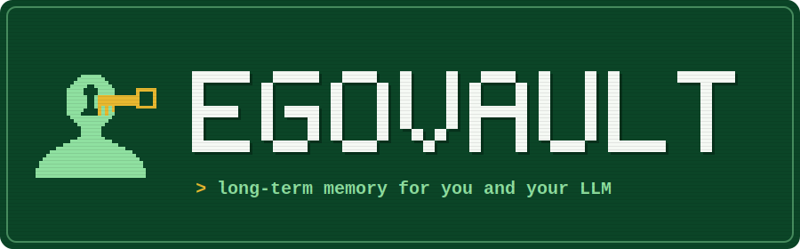
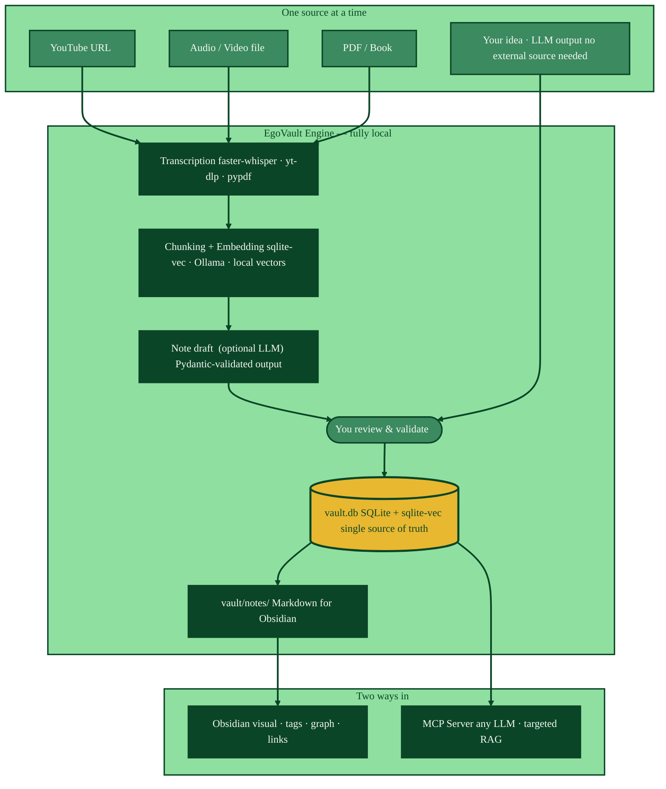
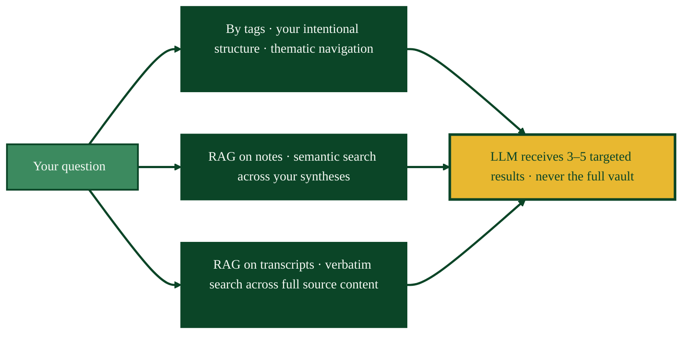
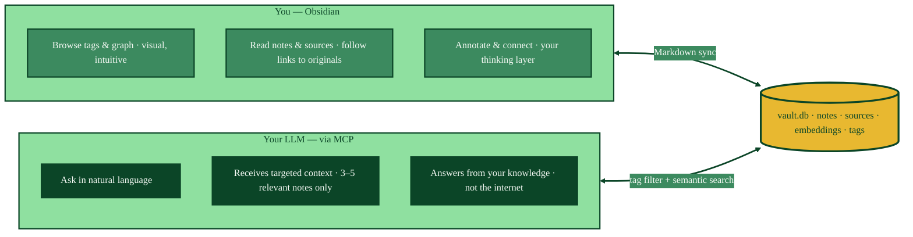

<p align="center">
  
</p>

# EgoVault

[](LICENSE)
[](https://www.python.org/)
[](#quick-start)
[](https://modelcontextprotocol.io)

Long-term memory for you and your LLM.
*Capture, tag, search, recall.*

EgoVault is a local knowledge pipeline — ingest YouTube videos, audio, PDFs, and ideas into a structured vault.   
Browse it in Obsidian. Query it with any LLM via MCP with targeted RAG.

---

[How it works](#how-it-works) · [What makes it different](#what-makes-it-different) · [Features](#features) · [Quick Start](#quick-start)

---

## The Aha Moment

*Here's what using EgoVault actually looks like.*

**You listen to a 3-hour Lex Fridman interview on AI and the future of work.**

You paste the URL. EgoVault takes over.

A few minutes later, you have a structured note — title, core thesis, key ideas, your tags — ready in your Obsidian vault.   
The full transcript is stored. The original source is preserved. Everything is searchable, forever.  

**Six months later**, you're thinking about automation and the future of jobs.

> *"What were the key arguments about AI replacing knowledge workers vs. augmenting them?"*

You or your LLM searches your vault. It finds your note *and* the exact passage from the interview — word for word, with a link back to the original. It answers from *your* knowledge, not the internet.

**That's it. Drop a source in. Permanent memory out.**

---

## How It Works



The pipeline is split by design. Transcription is saved before any LLM step — close the laptop mid-way, nothing is lost.

---

## What Makes It Different 

### The vault scales — quality never degrades

Most tools send your full vault to the LLM. At 200 notes it works. At 500 notes it starts breaking. At 1,000 notes, quality collapses. EgoVault never sends the full vault. Three search modes, each precise:



**By tags** — you navigate by the thematic structure *you* built. A query in `[risk, epistemology]` skips everything else instantly.

**RAG on notes** — semantic search across your syntheses. Ask about "Taleb's subtraction principle" and *via negativa* surfaces — meaning, not keywords.

**RAG on transcripts** — semantic search across the full chunked source content. Surfaces the exact passage, word for word, from the original audio, video, or PDF.

**The vault gets smarter as it grows.**

---

### Two depths — never lose information

Notes and sources are different things. Both matter.

**Notes = deliberate synthesis.** Your Taleb note is 400 tokens. Core thesis, your personal angle, links to related concepts. Fast to retrieve, rich with your thinking. Deliberately compressed.

**Sources = verbatim, lossless.** The full transcript — every word Taleb said — is chunked and embedded. Ask *"what exactly did Taleb say at 1h14m?"* and the engine retrieves the precise passage, word for word.

```
YouTube interview (3h)
        ↓  transcription
Full transcript  ~120,000 tokens ──────────→  stored in vault.db (lossless)
                                              + original URL preserved
        ↓  chunking + embedding
~150 chunks × 800 tokens ──────────────────→  chunks_vec  (source-level RAG)
        ↓  LLM synthesis + your annotation
Note ~400 tokens ──────────────────────────→  notes_vec   (note-level RAG)
        + your personal take
        + links to [[black-swan]], [[skin-in-the-game]]
        + tags: [risk, epistemology, antifragility]
```

Two levels of depth. One query. Zero information lost.

---

### Human + Machine — one vault, two ways in



A note you write in Obsidian is immediately searchable via MCP. A source ingested via the pipeline is immediately navigable in the graph. **One vault. Two ways in.**

---

### Determinism — the foundation nobody else has

Every AI knowledge tool lets the LLM write directly to your data. That's a bet it will never make a mistake. Over months of daily use, it will.

EgoVault takes the opposite stance: **the LLM touches exactly one thing.**

```
LLM generates ──→ note content (title · body · tags · note_type)
                        ↓
              Pydantic validates (schema + taxonomy)
                        ↓
              You review before any save
                        ↓
System generates ──→ uid · slug · timestamps · embeddings · DB write
```

The LLM cannot corrupt timestamps, break the schema, or override taxonomy rules.

**Proof: the LLM is completely optional.** Run the full pipeline — transcription, chunking, embedding, semantic search, MCP — without ever calling a LLM. Write your notes manually. The infrastructure works without it. No competitor can say this.

---

## Features

### Multi-media ingestion — every format, fully local

| Source | Method | Cloud needed? |
|---|---|:---:|
| YouTube video | Auto subtitles or Whisper fallback | ❌ |
| Audio file (.mp3, .wav…) | faster-whisper — local, GPU-accelerated | ❌ |
| Video file (.mp4, .mkv…) | Audio extraction → faster-whisper | ❌ |
| PDF / Book | pypdf text extraction | ❌ |
| Web article | *(coming soon)* | ❌ |
| Your idea / LLM output | Write directly — no transcription step | ❌ |

Your audio never leaves your machine. The transcript is saved before any LLM step — interruptions lose nothing.

---

### Custom generation templates *(coming soon)*

The LLM will generate notes from a `.yaml` template you control. The default `standard` template will ship with the repo. Add your own with zero code changes:

```yaml
# config/templates/generation/book-notes.yaml
name: book-notes
description: "Structured reading note — key ideas, quotes, personal critique"
system_prompt: |
  Extract knowledge from this book. Structure as:
  - Central thesis (1 paragraph)
  - 3–5 key ideas with supporting quotes
  - Author's methodology and limits
  - Personal critique and vault connections
```

```yaml
# config/system.yaml — register in one line
taxonomy:
  generation_templates:
    - standard
    - book-notes   # now available everywhere
```

Community templates will be shareable as standalone `.yaml` files.

---

### MCP server — bring your own LLM

Connect Claude, GPT, Cursor, or any local Ollama model. Zero lock-in. The server exposes every tool individually — search, read, write, export.

---

### Modular by design

| You want to… | Notes created? |
|---|:---:|
| Transcribe audio locally | ❌ |
| Semantic search only | ❌ |
| Ingest a source, write the note yourself | ✅ |
| Full pipeline with LLM draft | ✅ |
| Export a note as a print-ready PDF | ❌ |

Just a local transcription engine? Valid. A semantic search backend for your own project? Valid. A full knowledge pipeline? Also valid.

---

## How EgoVault Compares

| | Plain Obsidian | Obsidian + AI plugin | Notion AI | **EgoVault** |
|---|:---:|:---:|:---:|:---:|
| Capture friction eliminated | ❌ | ❌ | ❌ | ✅ (CLI coming) |
| LLM long-term memory (cross-session) | ❌ | ❌ | partial | ✅ |
| RAG — scales to 10,000+ notes | ❌ | ❌ | ❌ | ✅ |
| Dual-level RAG (notes + sources) | ❌ | ❌ | ❌ | ✅ |
| Tag filter + semantic proximity | ❌ | ❌ | ❌ | ✅ |
| MCP — works with any LLM | ❌ | ❌ | ❌ | ✅ |
| LLM-optional (deterministic core) | ✅ | ❌ | ❌ | ✅ |
| 100% local — zero cloud required | ✅ | partial | ❌ | ✅ |
| Open format — readable in 20 years | ✅ | ✅ | ❌ | ✅ |

---

## Quick Start

**Prerequisites:** Python 3.10+, [uv](https://docs.astral.sh/uv/), ffmpeg in PATH, [Ollama](https://ollama.com).

```bash
# 1. Clone and install
git clone https://github.com/Vincent-20-100/egovault
cd egovault
uv sync

# 2. Initialize your local vault
.venv/Scripts/python scripts/setup/init_user_dir.py

# 3. Edit config/user.yaml and config/install.yaml
#    (set your LLM provider and verify paths)

# 4. Pull the local embedding model
ollama pull nomic-embed-text

# 5. Verify
.venv/Scripts/python -m pytest tests/
```

Then connect EgoVault to Claude (or any MCP client) — see [`docs/mcp/CLIENT-SETUP.md`](docs/mcp/CLIENT-SETUP.md) for setup instructions.

---

## Architecture

### Three distinct locations

```
egovault/                    ← PUBLIC git repo  (engine · code · config)
egovault-data/               ← LOCAL, never in git (path configurable in install.yaml)
├── data/
│   ├── vault.db             ← SQLite + sqlite-vec — single source of truth
│   ├── .system.db           ← operational logs (hidden)
│   └── media/{slug}/        ← original binary files (audio · video · PDF)
└── vault/                   ← PRIVATE git repo  (Obsidian notes)
    ├── .obsidian/
    └── notes/               ← Markdown files rendered from DB
```

Backup: `vault.db` = copy the file. `vault/` = `git push`. Future PostgreSQL + S3 migration: swap `infrastructure/` only, zero changes elsewhere.

> Default path: `../egovault-data/` relative to the repo. Override in `config/install.yaml`.

### Hexagonal architecture

```
clients  (MCP server · api/ · frontend/ [coming])
    ↓
tools/  +  workflows/
    ↓
core/              ← abstract interfaces (Pydantic schemas · config · uid)
    ↑
infrastructure/    ← concrete implementations (SQLite · Ollama · vault_writer)
```

### Project structure

```
egovault/
├── core/               ← config · schemas · uid · logging
├── tools/
│   ├── media/          ← transcribe · compress · fetch_subtitles · extract_audio
│   ├── text/           ← chunk · embed · summarize
│   ├── vault/          ← create_note · update_note · search · finalize_source
│   └── export/         ← typst (print PDF) · mermaid (concept graph)
├── workflows/          ← unified ingest pipeline (extractor registry)
├── infrastructure/     ← db · vault_writer · embedding_provider · llm_provider
├── mcp/                ← server.py
├── api/                ← FastAPI HTTP layer (6 routers, factory pattern)
├── scripts/
│   ├── setup/          ← init_user_dir.py
│   └── temp/           ← one-shot migrations
├── config/
│   ├── system.yaml
│   ├── user.yaml.example
│   ├── install.yaml.example
│   └── templates/generation/
├── benchmark/          ← [coming] RAG evaluation framework
├── frontend/           ← [coming] local web UI
└── tests/
```

---

## Philosophy

- **Capture friction is the enemy** — one action to ingest, structuring comes after
- **SQL as truth, Markdown as output** — no sync issues, full integrity, backup is one file copy
- **The LLM proposes, the human decides** — nothing is saved without explicit validation
- **Determinism over magic** — every system field is generated by code, never inferred by a model
- **Infinite scale by design** — tag filter + semantic proximity mean vault size never degrades quality
- **Both depths preserved** — notes for signal, sources for truth, both searchable, always linked
- **Reversibility before optimization** — open formats, local files, portable in 20 years
